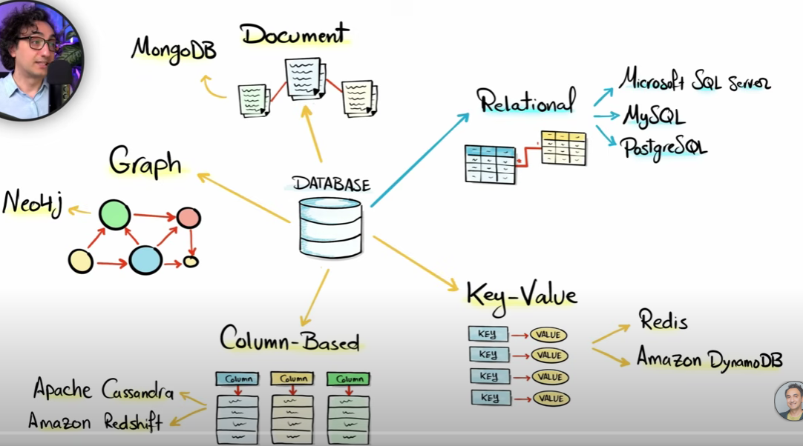

# 📘 Introduction

---

### 🔢 What is Data?

**Data** is any **meaningful raw fact or observation** that can exist in various forms such as:

- **Numbers** (e.g., 123, 45.67)
- **Characters** (e.g., A, %, #)
- **Physical objects** (e.g., a book, a person, a sensor reading)

> 🧠 In simple terms: **Data is raw, unorganized facts** that need processing.

#### 🧾 Examples of Data:
- Temperature = 30°C
- Student score = 95
- Name = "John"

---

### 📊 What is Information?

**Information** is **processed, organized, and structured data** that is meaningful and useful for decision-making.

> 📌 When data is analyzed and interpreted to provide meaning — it becomes **information**.

#### 🧾 Examples of Information:
- "The average temperature today is 30°C" → insight from raw temperatures
- "John scored highest in the class" → insight from all student scores

---

## 🧱 Key Differences

| Feature        | Data                                  | Information                                |
|----------------|---------------------------------------|--------------------------------------------|
| Definition     | Raw facts and figures                 | Processed and meaningful data              |
| Format         | Unstructured or structured            | Structured and interpreted                 |
| Purpose        | Input for processing                  | Output after analysis                      |
| Example        | 98, 76, 85 (student scores)           | Class average score = 86.3                 |

---

> 💡 **Data** is the raw material. **Information** is the finished product.
---
## 🗄️ What is a Database?

### 📘 Definition

A **Database** is an **organized collection of data** that is stored and accessed electronically.  
It allows data to be **easily stored, managed, retrieved, and updated**.

Databases are used everywhere — websites, apps, banking systems, hospitals, and more.

---

### 🧱 Key Features of a Database

| Feature                   | Description                                         |
|---------------------------|-----------------------------------------------------|
| 🔍 **Structured Storage** | Data is stored in tables, rows, and columns         |
| 🔄 **CRUD Operations**    | Supports Create, Read, Update, Delete operations    |
| 🎯 **Query Support**      | Retrieve specific data using query languages        |
| 🔐 **Security**           | Access control and data protection                  |
| 📊 **Scalability**        | Can handle large amounts of data efficiently        |

----

### 🧩 Types of Databases


| Type                   | Description                               | Examples                              |
|------------------------|-------------------------------------------|---------------------------------------|
| **Relational (RDBMS)** | Uses tables with rows and columns         | MySQL, PostgreSQL, Oracle, SQL Server |
| **NoSQL**              | Flexible, schema-less data formats        | MongoDB, Redis, Cassandra             |
| **In-Memory**          | Fast, stores data in RAM                  | Redis, Memcached                      |
| **Cloud Database**     | Hosted on cloud platforms                 | Amazon RDS, Firebase, Azure SQL       |
| **Graph**              | Stores data as nodes and edges            | Neo4j, Amazon Neptune                 |

---

### 🧰 Example: Relational Database Table (Users)

| id | name     | email              |
|----|----------|--------------------|
| 1  | Alice    | alice@example.com  |
| 2  | Bob      | bob@example.com    |

SQL query to retrieve users:
```sql
SELECT * FROM Users;
```
---
#### Uses of databases
* Data integrity
* Can handle massive amounts of data.
* Quickly combine different datasets
* Automate steps for re-use.
* Can support data for website and applications.
#### Users in databases
1. Analysts
   * Marketing
   * Business
   * sales
2. Technical
   * Data scientist
   * Software engineer
   * Web developer

## Data base platform
* PostgreSQL
* MySQL
* MariaSQL
* MS SQL
* SQLite
#### PostgreSQL ->That stores data and read query and returns information.
>[!NOTE]
> 
>pgAdmin-> Graphical user interface for connecting with PostgreSQL

#### SQL-> Structured query language or sequel query language
#### What is SQL?
* Is a programming language used to communicate with the databases.
---
## DBMS

### 🗄️ What is DBMS (Database Management System)?

#### 📘 Definition

A **DBMS (Database Management System)** is **software** that helps you **store, manage, and manipulate** data in a structured way.

It acts as a **bridge between users/applications and the database**, allowing:
- Easy data access
- Data security
- Data consistency
- Multi-user support

---

### 🧱 Key Functions of a DBMS

| Function               | Description                                        |
|------------------------|----------------------------------------------------|
| 📥 Data Storage        | Organizes data into tables (rows & columns)        |
| 🔍 Query Processing    | Executes queries to retrieve specific data         |
| 🔐 Access Control      | Manages user access and permissions                |
| 🛡️ Data Integrity     | Ensures data accuracy and consistency              |
| 🔄 Transaction Control | Handles commits and rollbacks (ACID compliance)    |
| 🧾 Backup & Recovery   | Protects data from loss or corruption              |

---

### 📊 Example

Let’s say you run an online store.

A DBMS can manage tables like:

**Table: Customers**

| id | name   | email             |
|----|--------|-------------------|
| 1  | Alice  | alice@email.com   |
| 2  | Bob    | bob@email.com     |

You can write a query like:
```sql
SELECT * FROM Customers WHERE name = 'Alice';
```
---
## RDBMS

## 📘 What is an RDBMS?

An **RDBMS (Relational Database Management System)** stores data in a **structured format using tables**, and manages the relationships between those tables using **keys**.

Each **table** represents a **relation**, and each row in the table is called a **tuple** (record), while each column is called an **attribute** (field).

### 🧩 Basic Structure
```yaml
Database
└── Tables
├── Columns (Attributes)
├── Rows (Records/Tuples)
└── Constraints (Primary key, Foreign key, etc.)
```
### 🗂️ Key Components of RDBMS Structure

| Component         | Description                                                   |
|-------------------|---------------------------------------------------------------|
| **Tables**        | The basic unit of data; organized in rows and columns         |
| **Rows**          | Represent records/instances                                   |
| **Columns**       | Represent fields/attributes (e.g., name, salary)              |
| **Primary Key**   | Uniquely identifies each row in a table                       |
| **Foreign Key**   | Links one table to another to establish relationships         |
| **Constraints**   | Rules applied to columns (e.g., NOT NULL, UNIQUE)             |
| **Schema**        | Blueprint of the database (table definitions, types, keys)    |

### 🔄 Difference Between DBMS and RDBMS
| Feature             | **DBMS (Database Management System)**                    | **RDBMS (Relational Database Management System)**                  |
|---------------------|----------------------------------------------------------|--------------------------------------------------------------------|
| 📊 **Data Structure**   | Stores data as files, records, or semi-structured formats | Stores data in **tables** (rows & columns)                         |
| 🔗 **Relationship Support** | Does **not support** relationships between data             | Supports **relationships** using **foreign keys**                  |
| 📐 **Data Model**       | Hierarchical, network, or object-oriented              | Strictly **relational** (based on E.F. Codd’s model)               |
| 🧩 **Schema**           | May be **dynamic or unstructured**                    | Requires a **fixed schema**                                        |
| 🧾 **Query Language**   | May not use SQL (or uses limited query languages)      | Uses full-featured **SQL (Structured Query Language)**             |
| 🔐 **Security**         | Basic authentication or file-level security            | Advanced **user access controls, roles, privileges**               |
| 👥 **Multi-user Support** | May not support concurrent access                    | Designed to support **multiple users simultaneously**              |
| 🧪 **Data Integrity**   | Manually enforced                                     | Ensures **data integrity** via constraints                         |
| 💾 **Storage**          | Small-scale applications                              | Large-scale, complex, enterprise-level applications                |
| 📚 **Examples**         | XML DB, JSON DB, Microsoft Access (basic), file systems | MySQL, PostgreSQL, Oracle, SQL Server, SQLite                      |

---
### 💎 ACID Properties in Database

#### 📘 What is ACID?

**ACID** stands for **Atomicity, Consistency, Isolation, and Durability** — the four key properties that ensure reliable processing of database transactions.

These properties guarantee that **data remains accurate, consistent, and safe**, even in the event of errors, power failures, or crashes.

---

### 🔑 ACID Properties Explained

| Property             | Description                                                                                                | Real-World Analogy                                                                   |
|----------------------|------------------------------------------------------------------------------------------------------------|--------------------------------------------------------------------------------------|
| ⚛️ **Atomicity**     | All steps in a transaction are treated as a single unit. Either **all succeed** or **none do**.            | ATM: Money must be debited from one account and credited to another — both or none.  |
| ✅ **Consistency**    | A transaction must bring the database from one **valid state to another**.                                 | If a product stock was 10, after selling 1, it must become 9 — no in-between states. |
| 🧍‍♂️ **Isolation**  | Concurrent transactions must not **interfere** with each other. Temporary changes are invisible to others. | Two people booking the same movie seat won't overwrite each other's booking.         |
| 🛡️ **Durability**   | Once a transaction is **committed**, its changes are **permanent**, even if the system crashes.            | After transferring money, the change remains even if the app crashes.                |

---

## 🧾 Example: Bank Transfer

```sql
BEGIN TRANSACTION;
UPDATE accounts SET balance = balance - 500 WHERE id = 1;  -- Debit
UPDATE accounts SET balance = balance + 500 WHERE id = 2;  -- Credit
COMMIT;
```
ACID stands for Atomicity, Consistency,Isolation, Durability  
* **Atomicity** : It treats all the transaction as single indivisible unit,It means that either all the operations within a transaction are successfully completed, or none of them are applied to the database. If any part of a transaction fails, all changes made by previous operations within the same transaction are rolled back. 
* **Consistency**: Consistency guarantees that a database remains in a valid state before and after each transaction execution. It ensures that only valid data is written to the database by enforcing predefined rules or constraints.
* **Isolation**: Isolation ensures concurrent transactions operate independently without interfering with each other's intermediate results 
* **Durability**: Durability guarantees that once committed, changes made by successful transactions are permanent and survive any subsequent failures such as power outages or system crashes.

ACID properties ensure reliable and consistent data management in databases and help maintain data integrity while allowing concurrent access to shared resources through proper isolation controls.