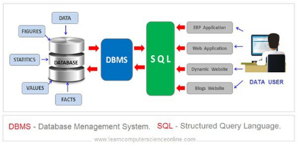
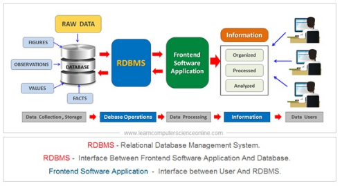

# 📘 Introduction

---

### 🔢 What is Data?

**Data** is any **meaningful raw fact or observation** that can exist in various forms such as:

- **Numbers** (e.g., 123, 45.67)
- **Characters** (e.g., A, %, #)
- **Physical objects** (e.g., a book, a person, a sensor reading)

> 🧠 In simple terms: **Data is raw, unorganized facts** that need processing.

#### 🧾 Examples of Data:
- Temperature = 30°C
- Student score = 95
- Name = "John"

---

### 📊 What is Information?

**Information** is **processed, organized, and structured data** that is meaningful and useful for decision-making.

> 📌 When data is analyzed and interpreted to provide meaning — it becomes **information**.

#### 🧾 Examples of Information:
- "The average temperature today is 30°C" → insight from raw temperatures
- "John scored highest in the class" → insight from all student scores

---

## 🧱 Key Differences

| Feature        | Data                                  | Information                                |
|----------------|---------------------------------------|--------------------------------------------|
| Definition     | Raw facts and figures                 | Processed and meaningful data              |
| Format         | Unstructured or structured            | Structured and interpreted                 |
| Purpose        | Input for processing                  | Output after analysis                      |
| Example        | 98, 76, 85 (student scores)           | Class average score = 86.3                 |

---

> 💡 **Data** is the raw material. **Information** is the finished product.
---
## 🗄️ What is a Database?

### 📘 Definition

A **Database** is an **organized collection of data** that is stored and accessed electronically.  
It allows data to be **easily stored, managed, retrieved, and updated**.

Databases are used everywhere — websites, apps, banking systems, hospitals, and more.

---

### 🧱 Key Features of a Database

| Feature                   | Description                                         |
|---------------------------|-----------------------------------------------------|
| 🔍 **Structured Storage** | Data is stored in tables, rows, and columns         |
| 🔄 **CRUD Operations**    | Supports Create, Read, Update, Delete operations    |
| 🎯 **Query Support**      | Retrieve specific data using query languages        |
| 🔐 **Security**           | Access control and data protection                  |
| 📊 **Scalability**        | Can handle large amounts of data efficiently        |

----

### 🧩 Types of Databases

| Type                   | Description                               | Examples                              |
|------------------------|-------------------------------------------|---------------------------------------|
| **Relational (RDBMS)** | Uses tables with rows and columns         | MySQL, PostgreSQL, Oracle, SQL Server |
| **NoSQL**              | Flexible, schema-less data formats        | MongoDB, Redis, Cassandra             |
| **In-Memory**          | Fast, stores data in RAM                  | Redis, Memcached                      |
| **Cloud Database**     | Hosted on cloud platforms                 | Amazon RDS, Firebase, Azure SQL       |
| **Graph**              | Stores data as nodes and edges            | Neo4j, Amazon Neptune                 |

---

### 🧰 Example: Relational Database Table (Users)

| id | name     | email              |
|----|----------|--------------------|
| 1  | Alice    | alice@example.com  |
| 2  | Bob      | bob@example.com    |

SQL query to retrieve users:
```sql
SELECT * FROM Users;
```
---
#### Uses of databases
* Data integrity
* Can handle massive amounts of data.
* Quickly combine different datasets
* Automate steps for re-use.
* Can support data for website and applications.
#### Users in databases
1. Analysts
   * Marketing
   * Business
   * sales
2. Technical
   * Data scientist
   * Software engineer
   * Web developer

## Data base platform
* PostgreSQL
* MySQL
* MariaSQL
* MS SQL
* SQLite
#### PostgreSQL ->That stores data and read query and returns information.
>[!NOTE]
> 
>pgAdmin-> Graphical user interface for connecting with PostgreSQL

#### SQL-> Structured query language or sequel query language
#### What is SQL?
* Is a programming language used to communicate with the databases.
#### DBMS

* Data base management system
* Which is the software use to store and manage the data(modify, insertion, deletion)
>Ex: foxpro,Foxbase, Dbase

#### RDBMS

* Relational database management system
* It allow us to access the data more efficiently
* It manages and stores the data in the form of tables and enhanced security features, good performance and allow us to store huge volume of data

| Specific         | DBMS                                                                                                                |RDBMS|
|------------------|---------------------------------------------------------------------------------------------------------------------|-|
| Data Model       | DBMS supports various data models, including hierarchical, network, and object-oriented models                      |RDBMS specifically uses the relational data model, where data is organized into tables with rows and columns|
| Data Relationship | In a DBMS, the relationships between data elements can be represented using pointers or physical links              |In an RDBMS, relationships are established using primary keys and foreign keys to maintain referential integrity|
| Data Integrity   | A DBMS does not enforce strict referential integrity constraints on its own                                         |An RDBM ensures referential integrity by defining relationships between tables through primary keys and foreign keys|
| Language         | A variety of programming languages can be used to interact with a DMBS Ex : SQL,Python(mysql-connecter-python),java |SQL (Structured Query Language) is the standard language for interacting with an RDMD|
| Scalability      | Not better as compared to RDBMS                                                                                     | RDMBs provide better scalability options due to their ability to distribute data across multiple servers (sharding).|
| ACID Complianc   | ACID (Atomicity, Consistency, Isolation, Durability) properties may or may not be fully supported in a DBMD         |An RDMD ensures full ACID compliance for maintaining data consistency and reliability|

## ACID
ACID stands for Atomicity, Consistency,Isolation, Durability  
* **Atomicity** : It treats all the transaction as single indivisible unit,It means that either all the operations within a transaction are successfully completed, or none of them are applied to the database. If any part of a transaction fails, all changes made by previous operations within the same transaction are rolled back. 
* **Consistency**: Consistency guarantees that a database remains in a valid state before and after each transaction execution. It ensures that only valid data is written to the database by enforcing predefined rules or constraints.
* **Isolation**: Isolation ensures concurrent transactions operate independently without interfering with each other's intermediate results 
* **Durability**: Durability guarantees that once committed, changes made by successful transactions are permanent and survive any subsequent failures such as power outages or system crashes.

ACID properties ensure reliable and consistent data management in databases and help maintain data integrity while allowing concurrent access to shared resources through proper isolation controls.