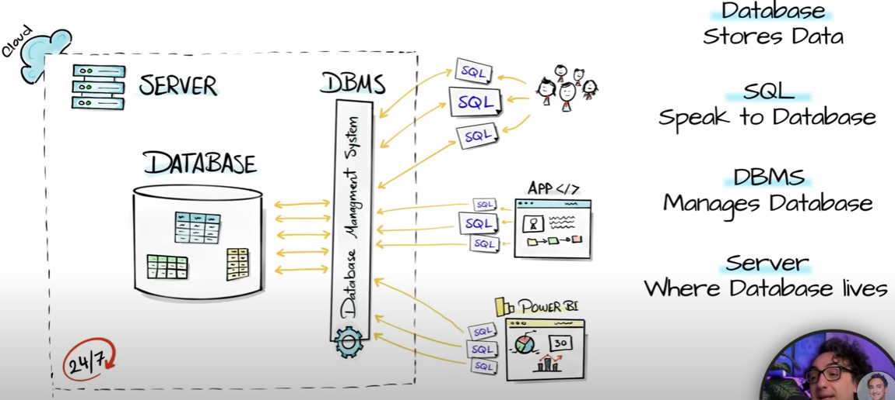

# Introduction 

---
### What is data?
Any meaning full thing which is present around us in the form of Numbers, character or Physical objects is known as data.
### What is information?
A collection of data is known as information.
### What are databases?
Databases are system allow and store data in organized manner,
#### Types of databases
1. File-system database model
2. Hierarchal database model
3. Network database model
4. Relational database model
### 1. File-system database model
This model was used during the year of 1950 and 1960 where all the data of information was stored in the form of numerous physical file.

#### Disadvantages
* There is no relationship among themselves.
* Data redundancy was present.
* Time taken to search information is more.

**Uses**
* This model is recommended only if data to be maintained at a minimum.
### 2. Hierarchal database model
Here data or information is stored in the form of tree like a structure there is partial relationship between table and files.

#### Disadvantages
* Data redundancy was reduced bit.
* Data searching becomes faster.
**Uses**
* This model is effective when comparing with filesystem model.
### 3. Network database model
* It is same like Hierarchal model here data is stored in the form of tree like structure and where the files will be connected to each other over the network
#### Disadvantages
* Maintaining the network is a little complicated.
* If any single node is failed, then entire network is get shutdown
**Uses**
* Where data redundancy is reduced maximum
* Searching becomes faster.

### 4. Relational database model
* This model was introduced in the year of 1970 by Edgar cod
* In this model data or information is stored in the form of numerous table and tables will be connected with each other using primary and foreign key
* Compared to previous model this model is effective and efficient model

#### Uses of databases
* Data integrity
* Can handle massive amounts of data.
* Quickly combine different datasets
* Automate steps for re-use.
* Can support data for website and applications.
#### Users in databases
1. Analysts
   * Marketing
   * Business
   * sales
2. Technical
   * Data scientist
   * Software engineer
   * Web developer

## Data base platform
* PostgreSQL
* MySQL
* MariaSQL
* MS SQL
* SQLite
#### PostgreSQL ->That stores data and read query and returns information.
>[!NOTE]
> 
>pgAdmin-> Graphical user interface for connecting with PostgreSQL

#### SQL-> Structured query language or sequel query language
#### What is SQL?
* Is a programming language used to communicate with the databases.
#### DBMS

* Data base management system
* Which is the software use to store and manage the data(modify, insertion, deletion)
>Ex: foxpro,Foxbase, Dbase

#### RDBMS

* Relational database management system
* It allow us to access the data more efficiently
* It manages and stores the data in the form of tables and enhanced security features, good performance and allow us to store huge volume of data

| Specific         | DBMS                                                                                                                |RDBMS|
|------------------|---------------------------------------------------------------------------------------------------------------------|-|
| Data Model       | DBMS supports various data models, including hierarchical, network, and object-oriented models                      |RDBMS specifically uses the relational data model, where data is organized into tables with rows and columns|
| Data Relationship | In a DBMS, the relationships between data elements can be represented using pointers or physical links              |In an RDBMS, relationships are established using primary keys and foreign keys to maintain referential integrity|
| Data Integrity   | A DBMS does not enforce strict referential integrity constraints on its own                                         |An RDBM ensures referential integrity by defining relationships between tables through primary keys and foreign keys|
| Language         | A variety of programming languages can be used to interact with a DMBS Ex : SQL,Python(mysql-connecter-python),java |SQL (Structured Query Language) is the standard language for interacting with an RDMD|
| Scalability      | Not better as compared to RDBMS                                                                                     | RDMBs provide better scalability options due to their ability to distribute data across multiple servers (sharding).|
| ACID Complianc   | ACID (Atomicity, Consistency, Isolation, Durability) properties may or may not be fully supported in a DBMD         |An RDMD ensures full ACID compliance for maintaining data consistency and reliability|